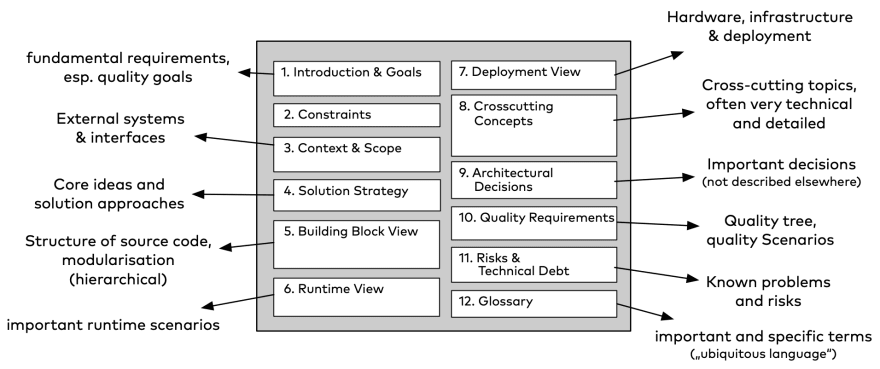
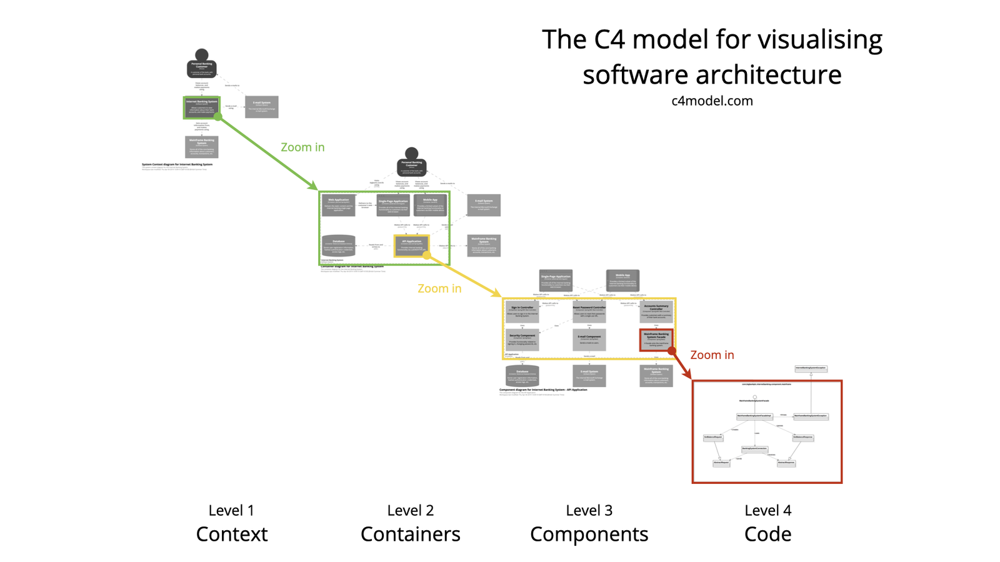

# Software Architecture Documentation: A Comprehensive Handbook

### 목적
Analysis
Communication

### Document Template

* `Arc42` - lightweight & Practical template for documentation of software
* `대상` - requirement,  building blocks, interface, deployment
- Class Diagram (Component Diagram)
- Sequence Diagram
- Interface Diagram
- 설계에 관한 Decision Making 포인트와 이유

#### Tools (Arc42) 
* `Data Schema Diagrams` - MySQL Workbench, MS SQL Server Management Studio, ER Diagram
* `Flowchart, Sequence Diagram` - Vision, Omni Graffle, Enterprise Architecture, Draw.io
* `Architecture Modeling Tool` - Mural, Giffy, Figma, Lucid Chart

* System Component, their 역할, 인터페이스, interactions, behavior - SmartUML
#### C4 Model 
* `C4Model` - good approach to obtain a common set of abstractions. It's an abstraction-first approach and is notation independent.
The C4 model looks at the static structures of a software system in terms of containers, components and code. And people use the software systems we build.

## 문서화 Template 목차 예시

SOFTWARE ARCHITECTURE DOCUMENT TITLE
### Introduction
* Purpose of Document
* Software system's scope and context
* Version history and document conventions

### Architecture Overview
* A high-level overview of the system's architecture
* System Objectives and Requirements
* System stakeholders and their roles

### Architectural Layout
* Diagram of overall system architecture (E.g., C4 Model)
* Diagrams of subsystems and components illustrating system structure and integration
* Diagram of hardware and software configuration for deployment

### Architectural Decisions
* Critical architectural decisions and their rationale
* Design patterns, architectural styles, and frameworks
* Justification for significant trade-offs and constraints
* System components

### Data Management and Retention
* Database schema architecture
* Data access and storage mechanisms
* Handling of data security, integrity, and privacy

### Quality Attributes
* Performance and Optimization Strategies
* Capacity planning and scalability
* Access controls and security measures
* Extensibility and maintainability guidelines

### Interfaces and Integration
* APIs and external system interfaces
* Communication protocols and message formats
* Software architecture patterns and Criteria for Integration

### Deployment and Infrastructure
* Deployment environment description (e.g., on-premises or cloud-based)
* Hardware and software specifications
* Configuration management and deployment procedures

### Quality Control and Testing
* Testing approaches and tactics
* Critical test scenarios for architecture evaluation
* Performance and stress testing
###  Maintenance and Support
* System updates and software maintenance services
* Issues identified
* Support and troubleshooting instructions

### Glossary
### References
### Appendix